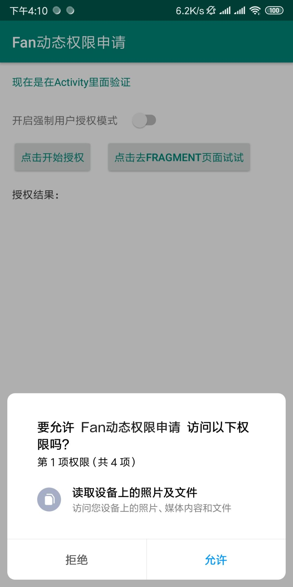
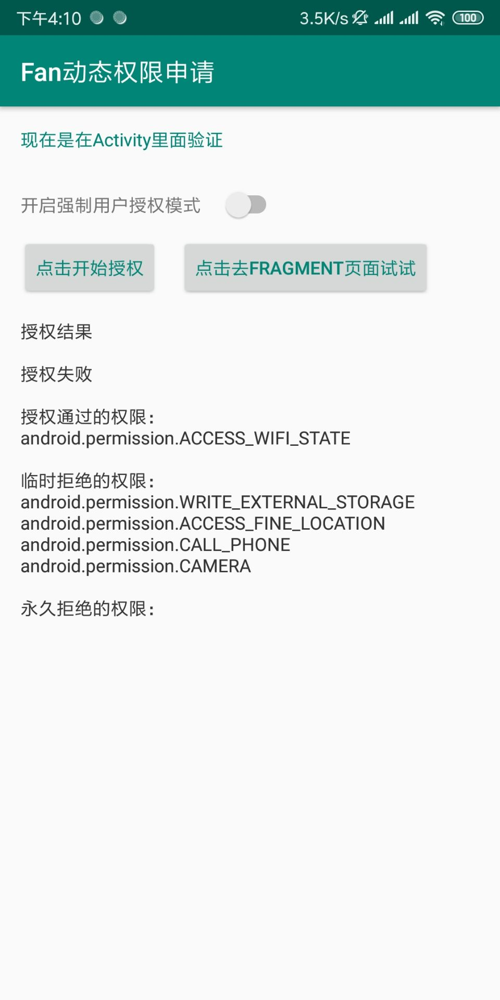
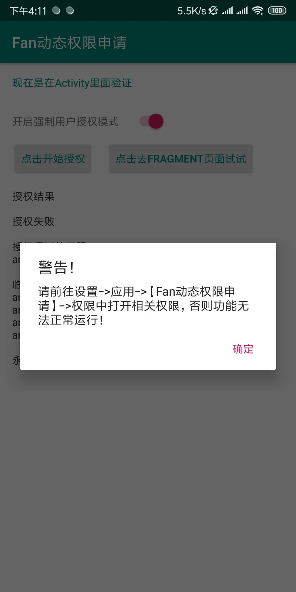

# **FanPermission**

## 简约动态权限申请库

[](https://jitpack.io/#MZCretin/FanPermission)

### 系列

在工作之余，打算将一些常用的逻辑页面，模块，功能点做成library库，这样当有相似需求的时候，可以做到插拔式开发！现在系列中有以下内容

+ [App内部自动更新-AutoUpdateProject](https://github.com/MZCretin/AutoUpdateProject)
+ [选择城市-CitySelect](https://github.com/MZCretin/CitySelect)
+ [扫描二维码条形码控件-ScanCode](https://github.com/MZCretin/CitySeScanCode)
+ [一键打开WebView件-WebViewUtils](https://github.com/MZCretin/WebViewUtils)
+ [简约动态权限申请库-FanPermission](https://github.com/MZCretin/FanPermission)

### 优势

+ **链式调用，一行代码搞定权限申请**
+ **支持强制用户授权才可使用**
+ **当用户点击不再提醒，会提示去设置页面授权使用**
+ **侵入性低，使用回调的方式反馈授权结果**
+ **无其他第三方依赖库污染，纯原生支持**

### demo下载

[Demo下载](https://raw.githubusercontent.com/MZCretin/FanPermission/master/pic/demo.apk)

扫描二维码下载：


### 效果预览

<div style="background:#e3e3e3; color:#FFF" align=center ></div>

### 使用方式

+ Step1 Add it in your root build.gradle at the end of repositories.

  ```java
  allprojects {
  	repositories {
  		...
  		maven { url 'https://jitpack.io' }
  	}
  }
  ```

+ Step2 Add the dependency.

  ```java
  dependencies {
  		implementation 'com.github.MZCretin:FanPermission:latest_version'
  }
  ```

+ Step3 Open scan activity wherever you want.
  ```java
  FanPermissionUtils.with(MainActivity.this)
          //添加所有你需要申请的权限
          .addPermissions(Manifest.permission.WRITE_EXTERNAL_STORAGE)
          .addPermissions(Manifest.permission.ACCESS_FINE_LOCATION)
          .addPermissions(Manifest.permission.CALL_PHONE)
          .addPermissions(Manifest.permission.ACCESS_WIFI_STATE)
          .addPermissions(Manifest.permission.CAMERA)
          //添加权限申请回调监听 如果申请失败 会返回已申请成功的权限列表，用户拒绝的权限列表和用户点击了不再提醒的永久拒绝的权限列表
          .setPermissionsCheckListener(new FanPermissionListener() {
              @Override
              public void permissionRequestSuccess() {
                  //所有权限授权成功才会回调这里
              }
              @Override
              public void permissionRequestFail(String[] grantedPermissions, String[] deniedPermissions, String[] forceDeniedPermissions) {
                  //当有权限没有被授权就会回调这里
                  //会返回已申请成功的权限列表（grantedPermissions）
                  //用户拒绝的权限列表（deniedPermissions）
                  //用户点击了不再提醒的永久拒绝的权限列表（forceDeniedPermissions）
              }
          })
          //生成配置
          .createConfig()
          //配置是否强制用户授权才可以使用，当设置为true的时候，如果用户拒绝授权，会一直弹出授权框让用户授权
          .setForceAllPermissionsGranted(aSwitch.isChecked())
          //配置当用户点击了不再提示的时候，会弹窗指引用户去设置页面授权，这个参数是弹窗里面的提示内容
          .setForceDeniedPermissionTips("请前往设置->应用->【" + FanPermissionUtils.getAppName(MainActivity.this) + "】->权限中打开相关权限，否则功能无法正常运行！")
          //构建配置并生效
          .buildConfig()
          //开始授权
          .startCheckPermission();
  ```
